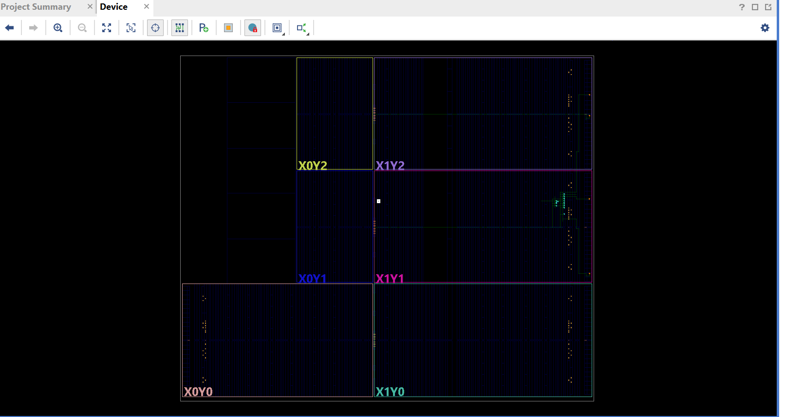

Introduction
This project implements a custom 8×8 TPU-style systolic array accelerator for matrix multiplication. The design multiplies an 8×8 weight matrix (Matrix A) with an 8×8 input/data matrix (Matrix B) using a fully pipelined parallel architecture. Before computation begins, the elements of both matrices are reordered into a systolic-friendly streaming format, then fed into dedicated input queues. These queues deliver one value per cycle into the systolic grid.
Each Processing Element (PE) performs a multiply–accumulate (MAC) operation using the weight and data values it receives. On every clock cycle, weights propagate from top to bottom, and data propagate from left to right. This movement creates a rhythmic “wavefront” of computation that spreads across the array—allowing all 64 PEs to work in parallel.
The design therefore achieves highly efficient matrix multiplication with a measured throughput of 8.951 GOPS in simulation.

Systolic Array Architecture
At the heart of the design is an 8×8 grid of Processing Elements.
Each PE contains three fundamental registers:
1.	A weight register to store and pass Matrix A elements downward
2.	A data register to store and pass Matrix B elements rightward
3.	An accumulator (ALU) to add the product of weight × data to the running partial sum
Together, these 64 PEs compute the entire 8×8 matrix multiplication in a wavefront fashion. Every cycle, new values enter from the top and left edges, propagate across the array, and partial sums accumulate until final results emerge from the bottom-right region.

Design Architecture (Modules Overview)
The full system is organized into modular Verilog components.
At the top level, tpu_top.v connects the systolic array, controller, and on-chip memory structures.
The systolic array itself is instantiated from systolic.v, which builds the 8×8 grid of PEs from pe.v.
A centralized control module (controller.v) coordinates data injection, propagation timing, and accumulation windows.
For FPGA deployment, tpu_fpga_wrapper.v maps the design to physical I/O—including clock, reset, start signals, and LED status.
This modular structure allows easy extension to larger arrays (e.g., 16×16) or integration with AXI interfaces for real system-on-chip use.
## Architecture Overview
Below is the high-level architecture of the 8×8 TPU-Style Systolic Array:

## Vivado Floorplan
The FPGA floorplan generated during implementation:

